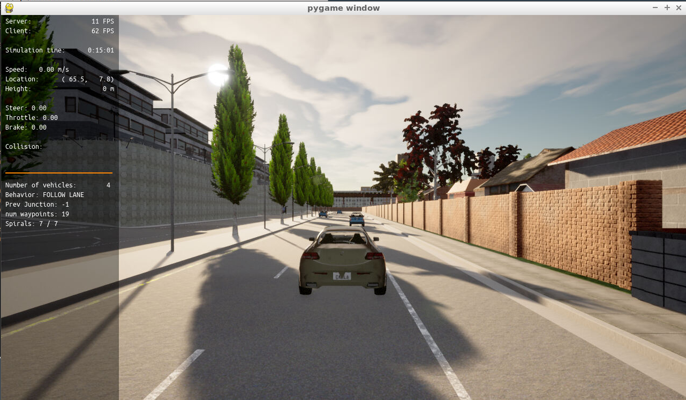
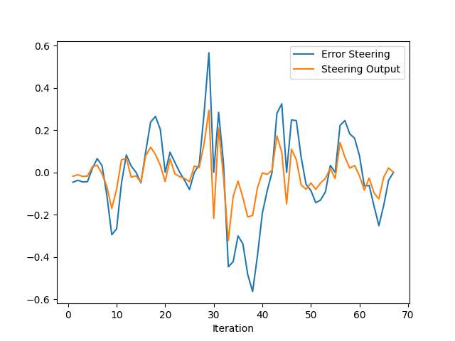
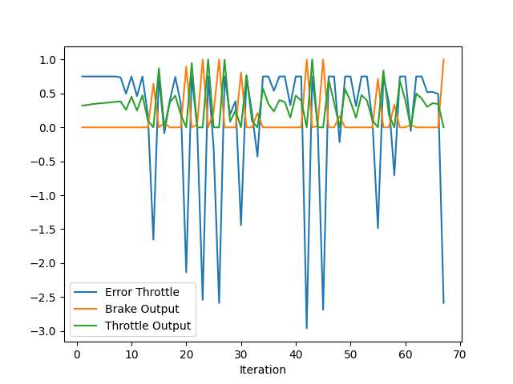

# Control and Trajectory Tracking for Autonomous Vehicle

# Proportional-Integral-Derivative (PID)

In this project, you will apply the skills you have acquired in this course to design a PID controller to perform vehicle trajectory tracking. Given a trajectory as an array of locations, and a simulation environment, you will design and code a PID controller and test its efficiency on the CARLA simulator used in the industry.

### Installation

Run the following commands to install the starter code in the Udacity Workspace:

Clone the <a href="https://github.com/udacity/nd013-c6-control-starter/tree/master" target="_blank">repository</a>:

`git clone https://github.com/udacity/nd013-c6-control-starter.git`

## Run Carla Simulator

Open new window

* `su - student`
// Will say permission denied, ignore and continue
* `cd /opt/carla-simulator/`
* `SDL_VIDEODRIVER=offscreen ./CarlaUE4.sh -opengl`

## Compile and Run the Controller

Open new window

* `cd nd013-c6-control-starter/project`
* `./install-ubuntu.sh`
* `cd pid_controller/`
* `rm -rf rpclib`
* `git clone https://github.com/rpclib/rpclib.git`
* `cmake .`
* `make` (This last command compiles your c++ code, run it after every change in your code)

## Testing

To test your installation run the following commands.

* `cd nd013-c6-control-starter/project`
* `./run_main_pid.sh`
This will silently fail `ctrl + C` to stop
* `./run_main_pid.sh` (again)
Go to desktop mode to see CARLA

If error bind is already in use, or address already being used

* `ps -aux | grep carla`
* `kill id`


## Project Instructions

In the previous project you built a path planner for the autonomous vehicle. Now you will build the steer and throttle controller so that the car follows the trajectory.

You will design and run the a PID controller as described in the previous course.

In the directory [/pid_controller](https://github.com/udacity/nd013-c6-control-starter/tree/mathilde/project_c6/project/pid_controller)  you will find the files [pid.cpp](https://github.com/udacity/nd013-c6-control-starter/tree/mathilde/project_c6/project/pid_controller/pid.cpp)  and [pid.h](https://github.com/udacity/nd013-c6-control-starter/tree/mathilde/project_c6/project/pid_controller/pid.h). This is where you will code your pid controller.
The function pid is called in [main.cpp](https://github.com/udacity/nd013-c6-control-starter/tree/mathilde/project_c6/project/pid_controller/main.cpp).

### Step 1: Build the PID controller object
Complete the TODO in the [pid_controller.h](https://github.com/udacity/nd013-c6-control-starter/tree/mathilde/project_c6/project/pid_controller/pid_controller.h) and [pid_controller.cpp](https://github.com/udacity/nd013-c6-control-starter/tree/mathilde/project_c6/project/pid_controller/pid_controller.cpp).

Run the simulator and see in the desktop mode the car in the CARLA simulator. Take a screenshot and add it to your report. The car should not move in the simulation.
### Step 2: PID controller for throttle:
1) In [main.cpp](https://github.com/udacity/nd013-c6-control-starter/tree/mathilde/project_c6/project/pid_controller/main.cpp), complete the TODO (step 2) to compute the error for the throttle pid. The error is the speed difference between the actual speed and the desired speed.

Useful variables:
- The last point of **v_points** vector contains the velocity computed by the path planner.
- **velocity** contains the actual velocity.
- The output of the controller should be inside [-1, 1].

2) Comment your code to explain why did you computed the error this way.

3) Tune the parameters of the pid until you get satisfying results (a perfect trajectory is not expected).

### Step 3: PID controller for steer:
1) In [main.cpp](https://github.com/udacity/nd013-c6-control-starter/tree/mathilde/project_c6/project/pid_controller/main.cpp), complete the TODO (step 3) to compute the error for the steer pid. The error is the angle difference between the actual steer and the desired steer to reach the planned position.

Useful variables:
- The variable **y_points** and **x_point** gives the desired trajectory planned by the path_planner.
- **yaw** gives the actual rotational angle of the car.
- The output of the controller should be inside [-1.2, 1.2].
- If needed, the position of the car is stored in the variables **x_position**, **y_position** and **z_position**

2) Comment your code to explain why did you computed the error this way.

3) Tune the parameters of the pid until you get satisfying results (a perfect trajectory is not expected).

### Step 4: Evaluate the PID efficiency
The values of the error and the pid command are saved in thottle_data.txt and steer_data.txt.
Plot the saved values using the command (in nd013-c6-control-refresh/project):

```
python3 plot_pid.py
```

You might need to install a few additional python modules: 

```
pip3 install pandas
pip3 install matplotlib
```

## Rubric Points

As seen in the first picture, the simulator is running fine:



### Plotting the Steer



The curve can be explained as the expected steering against the real or current steering. The Blue curve is the error steering while the orange is the current steering output.

The error curve reaches the maximum value around 0.6 close to the iteration 30 and right afeter close to the iteration 40 it reaches a negative error around -0.6 which shows de PID trying to compensate the steering.

### Plotting the Throttle



We can observe the the error throttle line in blue, the real break output in orange and the real throttle ouput in green.

The throttle errer reaches negative values mostly when the break is active while it remains around 0.75 during the real throttle ouput. As it is a proportional controller (PID), the throttle output is proportional to the throttle error. We can see a trend in both curves.


### What is the effect of the PID according to the plots, how each part of the PID affects the control command?

As the PID controller has a proportional part, the outputs are proportional to the error, but they will not be equal since there is a derivative term of the controller to control some overshooting.

One important thing is:

- Steering Output is proportional to the Steering Error
- Throttle Output is proportional to the Throttle Error

The Derivative term of the controller seems to have a small effect since the error is almost constant.

The Integrative term helps to monitor the error to reduce the error. The integral in this case is actually a summation of errors over each step.

### How would you design a way to automatically tune the PID parameters?

We can use an optimization algorithm in a simulation environment to search in the PID terms space the local or global best parameters. An example would the the [Twiddle Algorithm](https://martin-thoma.com/twiddle/) or simply a gradient descent.

Other possibility is to install a loop system where the controller changes its parameters automatically and using a metric it knows how far it is going.

### PID controller is a model free controller, i.e. it does not use a model of the car. Could you explain the pros and cons of this type of controller?

We can summarize the pros and cons of the PID controller as:

The advantage of PID controller is its feasibility and easy to be implemented. The PID gains can be designed based upon the system parameters if they can be achieved or estimated precisely. Moreover, the PID gain can be designed just based on the system tracking error and treats the system to be "blackbox" if the system parameters are unknown. However, PID controller generally has to balance all three-gains impact to the whole system and may compromise the transient response, such as settling time, overshoots, oscillations. If the system parameters can not be precisely estimated or achieved, the designed PID gains may not resist the uncertainties and disturbances, and thus present low robustness. Even though the PID gains can be well-designed, the PID controller still has low robust ability compared with the robust controller when the system encounters to multiple challenges from the operating environment of the system, such as temperature, weather, power surge, and so on.


